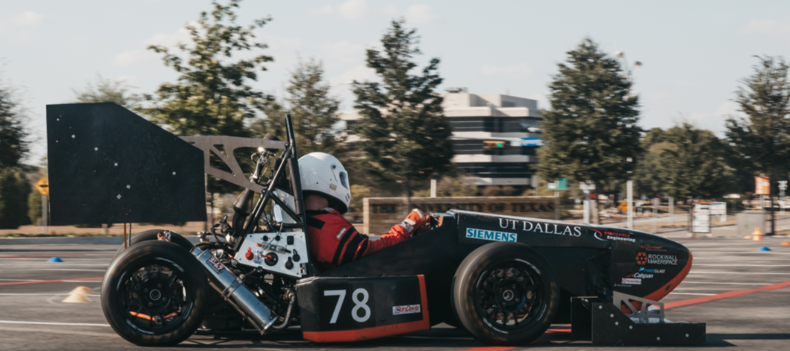

.. Data Acquisition 2.0 documentation root file

Welcome to DFR's Data Acquisition API documentation!
====================================================

.. toctree::
   :maxdepth: 2
   :caption: Application Layer
   :hidden:

   data_logger/index
   

.. toctree::
   :maxdepth: 2
   :caption: Sensor Layer
   :hidden:

   engine_control_unit/index
   linear_potentiometer/index

.. toctree::
   :maxdepth: 2
   :caption: Platform Layer
   :hidden:

   peripheral_interfaces/index
   stmicroelectronics/index

These pages are auto-generated from our source code. Each firmware component is organized as the following. For high-level design and development documentation, go to our repository's `wiki <https://github.com/DallasFormulaRacing/DataAcquisition2.0/wiki/>`_.

Index Table
-----------

* :ref:`genindex`

Firmware Architecture
---------------------

Application Layer
^^^^^^^^^^^^^^^^^

- High-level code.
- Will mostly consist of logic rather than nitty-gritty details.
- Will not be constrained to a particular product.

Sensor Layer
^^^^^^^^^^^^

- Low-level code.
- Consists of drivers. That is, libraries to support sensors and external devices.
- Product-specific code.

Platform Layer
^^^^^^^^^^^^^^

- Low-level code.
- Access to microcontroller peripherals.
- Platform-specific code. Such as, making use of I2C on an STM32 with the HAL library vs. on a TI microcontroller.